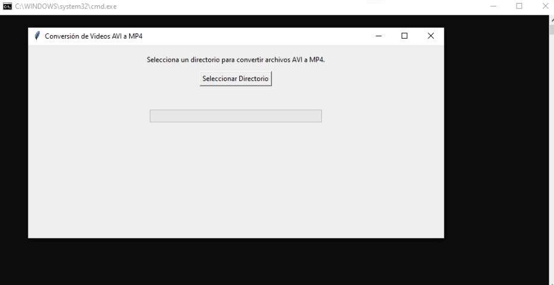
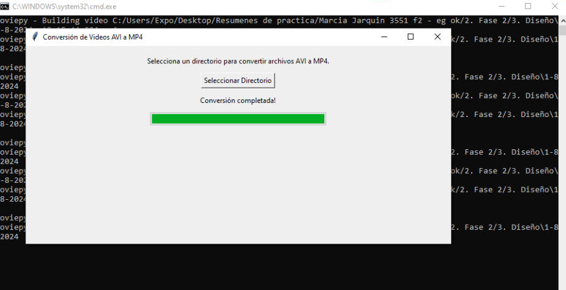

# Conversor de Video con Tkinter y MoviePy

Este proyecto es una aplicación de conversión de video que utiliza Tkinter para la interfaz gráfica y MoviePy para el procesamiento de videos.




## Descripción

La aplicación permite a los usuarios seleccionar archivos de video y convertirlos a diferentes formatos. La interfaz gráfica es proporcionada por Tkinter, y MoviePy se utiliza para manejar la conversión de video.

## Características

- Selección de archivos de video para convertir.
- Conversión de videos a varios formatos.
- Interfaz gráfica amigable.

## Requisitos

Asegúrate de tener las siguientes dependencias instaladas:

- **Python** (3.x)
- **Tkinter**: Para la interfaz gráfica.
- **MoviePy**: Para el procesamiento de video.

Puedes instalar las dependencias necesarias ejecutando:

```bash
pip install -r requirements.txt
```

## Instalación

1. Clona el repositorio:
```bash
git clone https://github.com/EstebanJGarcia/Convertidor-Avi-to-mp4.git
```

2. Navega al directorio del proyecto:

```bash
cd Convertidor-Avi-to-mp4
```

3. Crea y activa un entorno virtual (opcional, pero recomendado):

```bash
python -m venv venv
source venv/bin/activate  # En Windows usa: venv\Scripts\activate
```

4. Instala las dependencias:

```bash
pip install -r requirements.txt
```


## Uso

1. ejecuta la apliación
```bash
python main.py
```

2. Usa la interfaz gráfica para seleccionar archivos de video y convertirlos a los formatos deseados.

## Contribuciones

Las contribuciones son bienvenidas. Si tienes sugerencias o mejoras, por favor, abre un issue o envía un pull request.


## Licencia

Este proyecto está licenciado bajo la Licencia MIT - consulta el archivo LICENSE para más detalles.

Contacto

Si tienes preguntas o comentarios, puedes contactarme.
